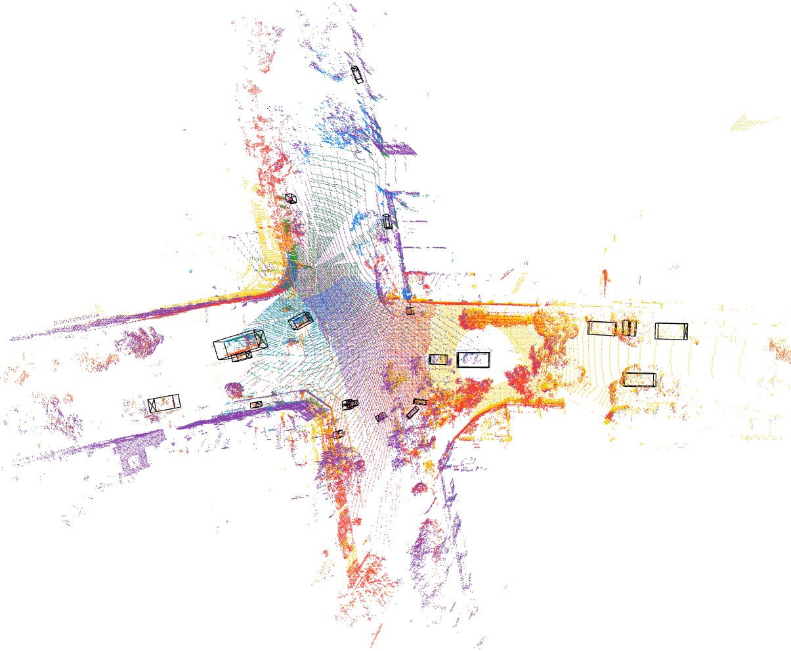

# DEVKIT OF MIXED SIGNALS DATASET
---

# 0. GET THE DATASET
The dataset can be downloaded from http://ieee-dataport.org/competitions/mixed-signals-v2x-dataset

After unzipping, the dataset directory has the following structure:

```bash
dataset_root
├── Odometry
│   ├── mini_20
│   └── mini_29
├── PointClouds
│   ├── mini_20
│   └── mini_29
└── V2X_dataset-v0.4-labels.json
```

---
# 1. INSTALLATION

The dataset interface **does not** require NVIDIA drivers and PyTorch.

```bash
conda create -n msig python=3.9
conda activate msig
pip install -r requirements.txt
python setup.py develop
```

---
# 2. VISUALIZING DATASET

Visualize point clouds in 1 data sample

```bash
cd mixedsignals

python mixedsignals/tools/visualize_agg_pointclouds.py --data_root <path_to_dataset_root> --seq_idx <index_of_a_sequence_to_visualize>
```

expected result:



Visualize tracks in 1 sequence


```bash
cd mixedsignals

python mixedsignals/tools/visualize_tracks.py --data_root <path_to_dataset_root> --seq_idx <index_of_a_sequence_to_visualize>
```